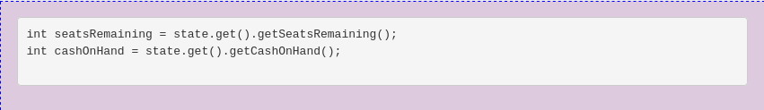

# Problems for Assignment #2

1.  In the mutex-locking pseudocode of Figure 4.10 on page 111, there are two consecutive steps that remove the current thread from the runnable threads and then unlock the spinlock. Because spinlocks should be held as briefly as possible, we ought to consider whether these steps could be reversed, as shown in Figure 4.28 [on page 148]. Explain why reversing them would be a bad idea by giving an example sequence of events where the reversed version malfunctions.\
    \
    `ANSWER HERE`

2.  Suppose the first three lines of the audit method in Figure 4.27 on page 144 were replaced by the following two lines:
    

    - Explain why this would be a bug: <br>

```
   State snapshot = state.get() makes sure that getSeatsRemaining() and getCashonhand is referencing the same state. By removing snapshot, the bug will occur because when the state objects are called such as state.get().getSeatsRemaining() and state.get().getCashOnHand() may possibly be updated, which will then lead to different values returned from getSeatsRemaining() and getCashonHand().
```

3.  **IN JAVA:** Write a test program in Java for the BoundedBuffer class of Figure 4.17 on page 119 of the textbook. <br>

```
 Refer to BoundedBufferTest.java
```

4. **IN JAVA:** Modify the BoundedBuffer class of Figure 4.17 [page 119] to call notifyAll() only when inserting into an empty buffer or retrieving from a full buffer. Test that the program still works using your test program from the previous exercise. <br>

```
Refer to BoundedBuffer.java
```

5. Suppose T1 writes new values into x and y and T2 reads the values of both x and y. Is it possible for T2 to see the old value of x but the new value of y? Answer this question three times: once assuming the use of two-phase locking, once assuming the read committed isolation level is used and is implemented with short read locks, and once assuming snapshot isolation. In each case, justify your answer.<br>
   `ANSWER HERE`

6. Assume a page size of 4 KB and the page mapping shown in Figure 6.10 on page 225. What are the virtual addresses of the first and last 4-byte words in page 6? What physical addresses do these translate into?<br>
   `ANSWER HERE`

7. At the lower right of Figure 6.13 on page 236 are page numbers 1047552 and 1047553. Explain how these page numbers were calculated.<br>
   `ANSWER HERE`

8. Write a program that loops many times, each time using an inner loop to access every 4096th element of a large array of bytes. Time how long your program takes per array access. Do this with varying array sizes. Are there any array sizes when the average time suddenly changes? Write a report in which you explain what you did, and the hardware and software system context in which you did it, carefully enough that someone could replicate your results.<br>
   `ANSWER HERE`

9. Figure 7.20 [page 324] contains a simple C program that loops three times, each time calling the fork() system call. Afterward it sleeps for 30 seconds. Compile and run this program, and while it is in its 30-second sleep, use the ps command in a second terminal window to get a listing of processes. How many processes are shown running the program? Explain by drawing a family tree of the processes, with one box for each process and a line connecting each (except the first one) to its parent.<br>
   `ANSWER HERE`
