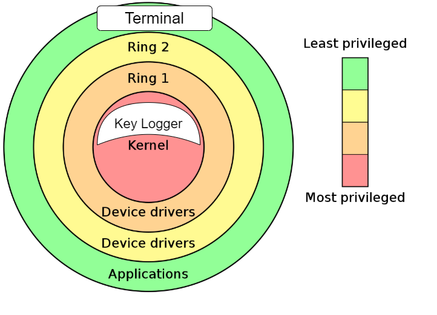

# Detailed Design

### 2.1 – Detailed list of Linux modules that will be modified/affected

- No module will be directly affected. We will be making our own.

### 2.2 – Detailed list of any new modules that you will produce [or 'Not Applicable' if there are none]

- Our new module we will produce will take the keyboard input of a user and store it. While only allowing admin or sudo user to view it.

### 2.3 – Class diagram showing affected modules [and any new modules] and how they related to one another

- 

### 2.4 – List or table of explanations of all command line options that will be implemented

- `sudo make`
  - Run a script or build from source
- `insmod keylogger.ko`
  - to insert module
- `rmmod`
  - remove module
